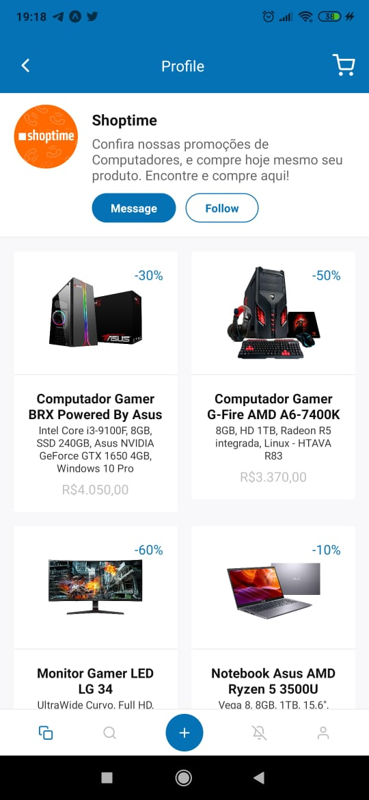

<h1 align="center">
    PROMOTIONS APP
</h1>

 

  
  

## :rocket: Tecnologias

Esse projeto foi desenvolvido com as seguintes tecnologias:

- [React Native](https://facebook.github.io/react-native/)
- [Expo](https://expo.io/)

## 💻 Projeto

Promotion App é um aplicativo que ajuda a encontrar cupons de desconto, códigos promocionais e ofertas de milhares de loja, a criação do layout foi baseado no projeto online da Rocketseat.  
